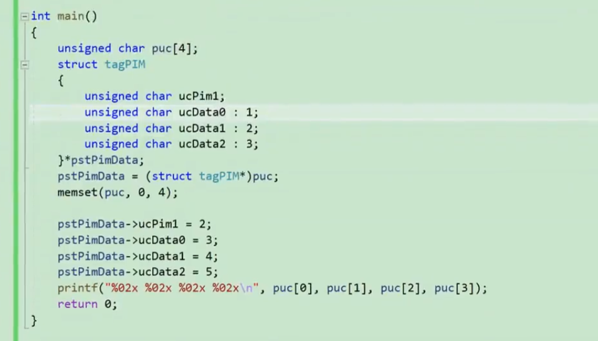
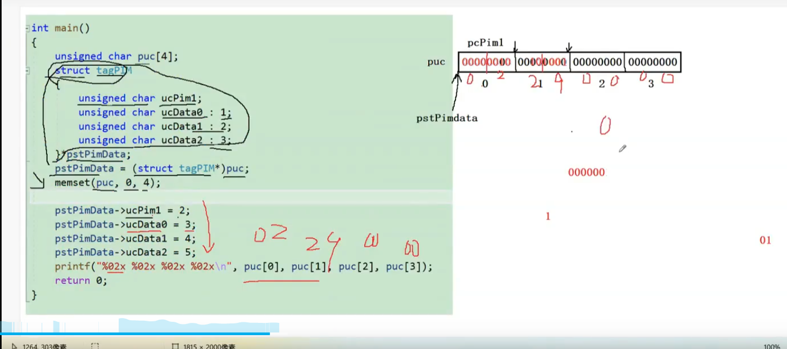
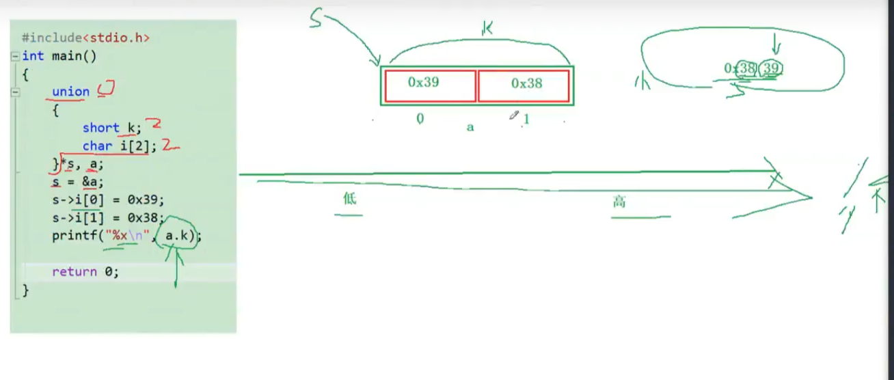
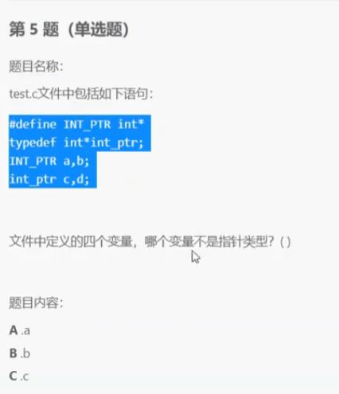

`%02x` 16进制 打印2位 不够补0




2  大小端




```c
#include<stdio.h>  
union var{  
        char c[4];  
        int i;  
};  

int main(){  
        union var data;  
        data.c[0] = 0x04;//因为是char类型，数字不要太大，算算ascii的范围~  
        data.c[1] = 0x03;//写成16进制为了方便直接打印内存中的值对比  
        data.c[2] = 0x02;  
        data.c[3] = 0x11;  // 04 03 02 11
//数组中下标低的，地址也低，按地址从低到高，内存内容依次为：04,03,02,11。总共四字节 
//而把四个字节作为一个整体（不分类型，直接打印十六进制），应该从内存高地址到低地址看，0x11020304，低位04放在低地址上。  
        printf("%x\n",data.i);  
}  
```

```c
int main(void)
{
	union
	{
		short i;
		char a[2];  // 11 22 
	}u;
	u.a[0] = 0x11;
	u.a[1] = 0x22;
	printf("0x%x\n", u.i);  //0x2211 为小端  0x1122 为大端
	return 0;
}

```


define  替换  

` int *a,b`

typedef 重命名  

选b

