# 指针叫法

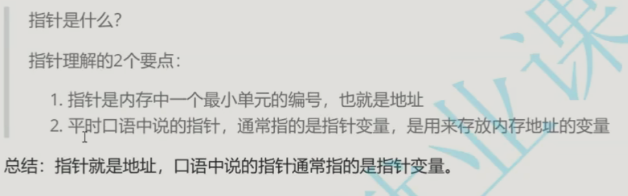

## 指针 

​	就是地址

​	每块内存有唯一对应的指针（内存地址）


## 指针变量（口语指针）  

存放地址的变量

​	存放在指针中的值都被当成地址来处理


## 内存

​	每块内存单元有1个字节

​	一个指针可以找到一个内存单元

如下

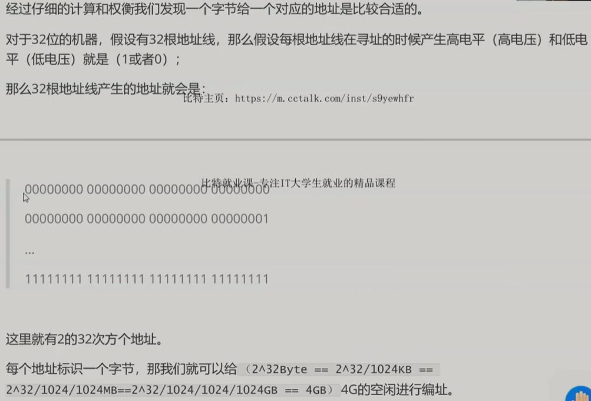

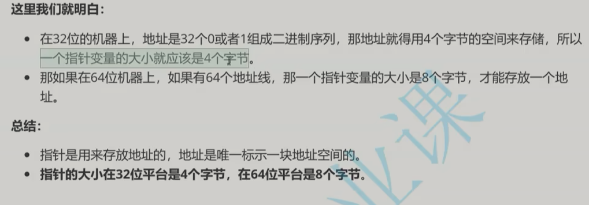

如上：  指针大小 在64位平台时8字节


# 指针类型


## 意义

：：： 访问内存权限，跳过内存方式  ==》》选择合适的指针类型

指针类型不一样 ， 权限不同

## 结论1：访问权限

/指针类型决定了指针在被解引用的时候访问几个字节权限
/如果是int*的指针，解引用访问4个字节
/如果是char*的指针，解引用访问1个字节
/推广到其他类型

不同指针类型 解引用操作时 访问字节数不同


int* 改动4个字节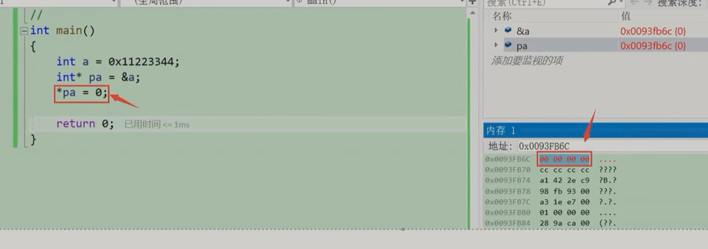

char* 改动1个字节


## 结论2：步长

/指针的类型决定了指针+-1操作的时候，跳过几个字节

//决定了指针的步长  ，  


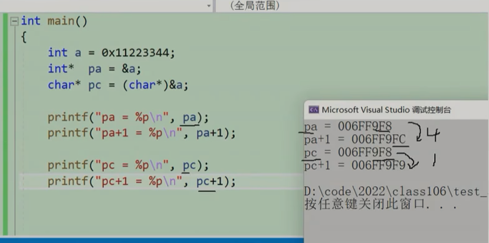

## 迷思

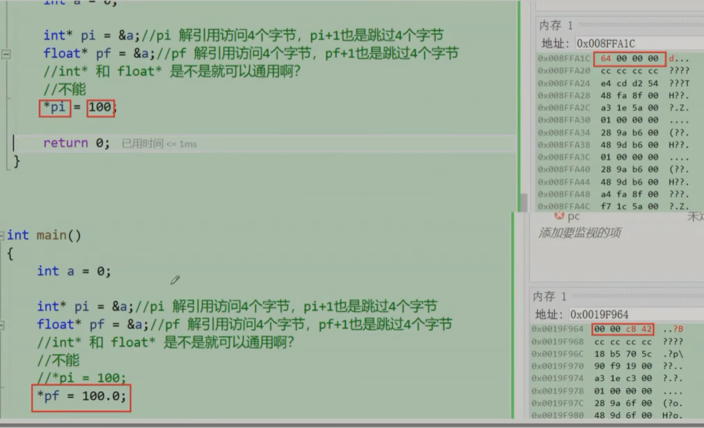

int* float*   

int float 在内存存储方式不同， 不能通用


# 野指针


## 指针没有初始化

分配随机内存 ， 造成非法访问内存

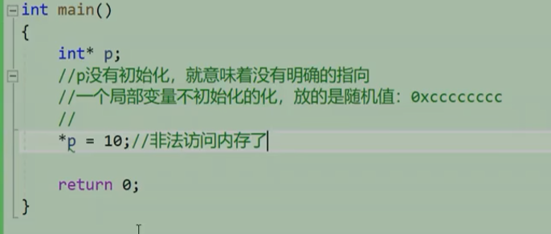

## 指针越界访问

​	指针访问到数组外

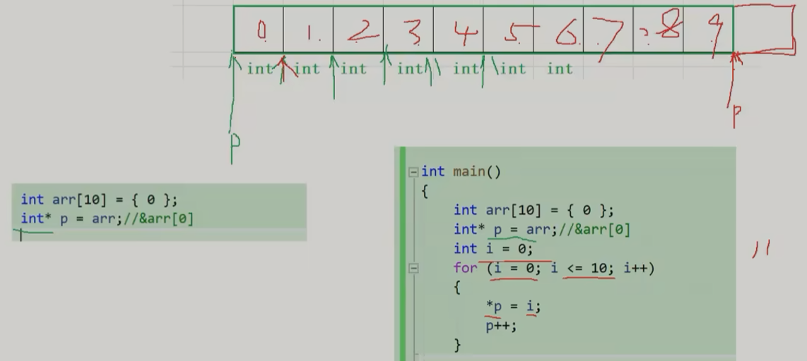


## 局部变量销毁 

造成野指针

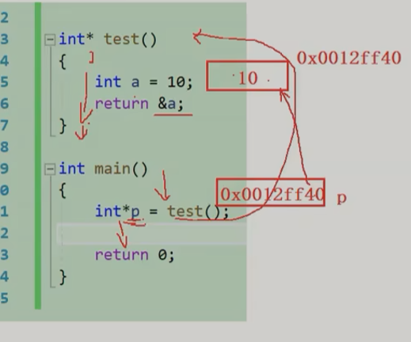


## 规范使用

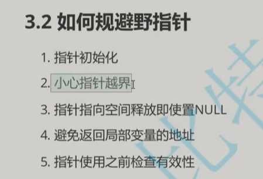

1 明确初始化指针， 明确指向


2 不知道初始化什么时 给 NULL ， 用时先判断：如下

```c
int* p = NULL;
// *p = 100; //err  
// NULL空指针相当于0地址 ， 0地址内存不可访问
if（p != NULL)
{
  //赋值
}
```

指针 =》 野狗

初始化 =》 找主人

赋值 NULL =》 没找到主人， 先栓到树上 ， 不会乱咬人

if （ p != NUll ) =》 没栓到树上 ， 表示有主人 ，不可以领养

\*p  =》 给领养人 


# 指针运算


## 指针 加减 整数


指针指向地址加减 

低位地址 小于 高位地址 地址可以比较


利用地址给数组循环赋值

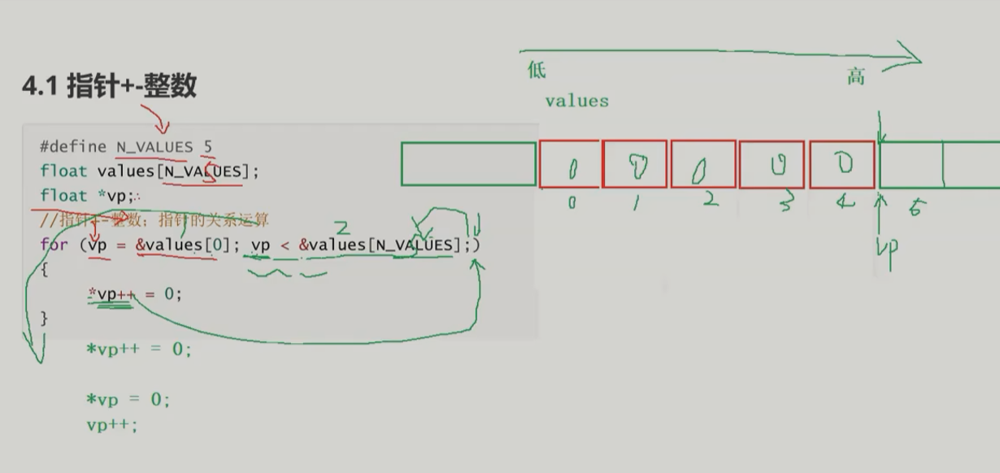


```c
*vp++ = 0;
//  从右到左  后加加先f
 *vp = 0； //
  vp++;
```


\* 符号 和 ++ -- 同优先级， 从右向左结合

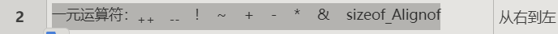

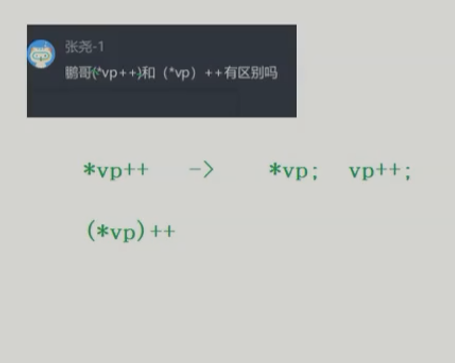


利用指针循环赋值

正序赋值

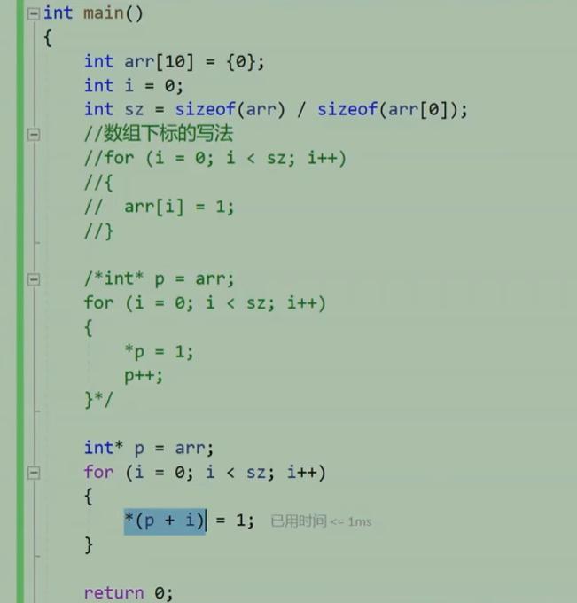


## 指针-指针


前提： 指向同一块空间的指针


|指针-指针|  =》 两指针之间元素个数


求字符串长度

最后一位指针+1  - 头指针


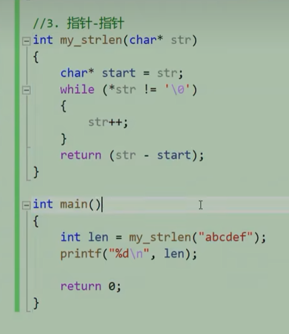

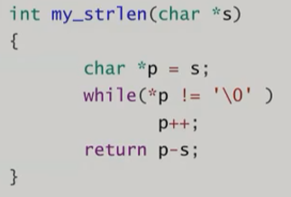

```c
int my_strlen(char* s)
{
  char *p = s;    // 拷贝初始指针
  while(*p != '/0')   
  {
    p++;
  }
  return p - s;
}
```


## 指针关系


指针逆序循环赋值

​	指针指向5

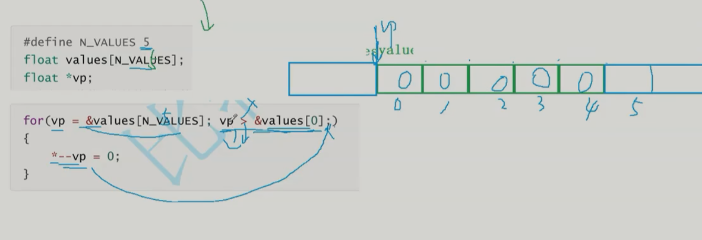

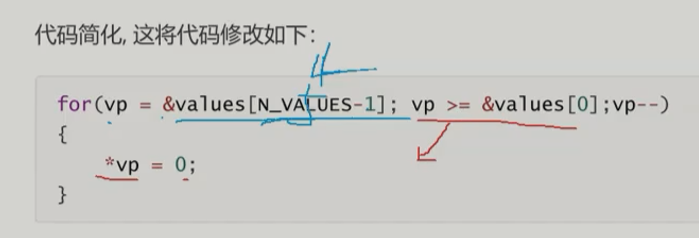

指针指向4 ， 指针-- ， 解引用赋值， 

```c
for(vp = &value[N_VALUES - 1]; vp >= &values[0]; vp--)
{
  *vp = 0;
}
```


### 比较规定

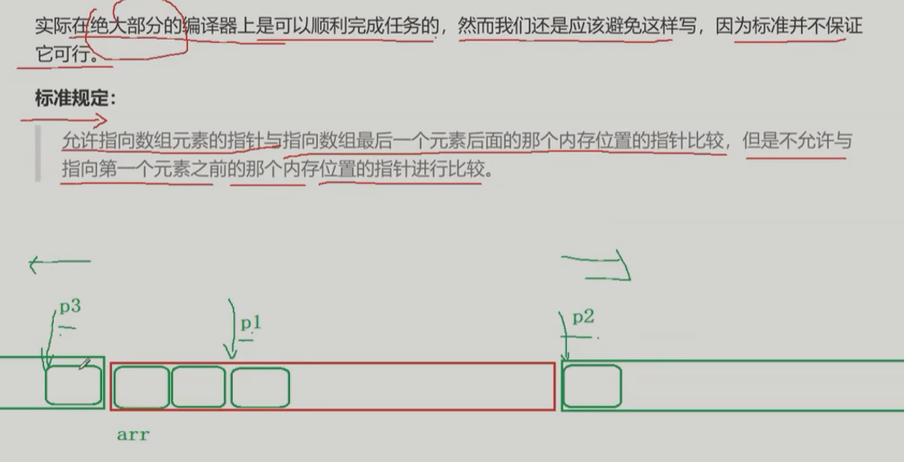


可以p2 比较 p1;


## 指针 与 数组


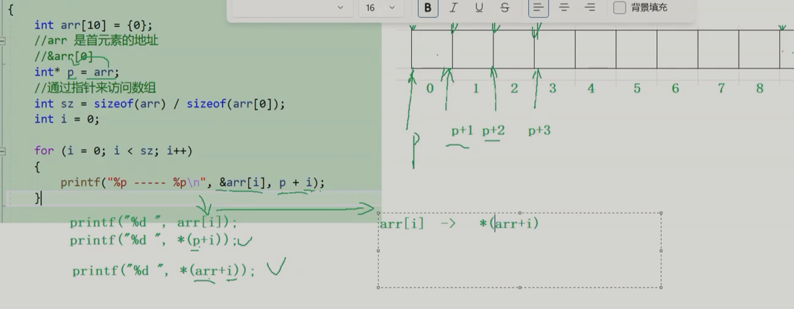

数组本质

arr[i] => \*(arr + i);


# 二级指针

## 图解

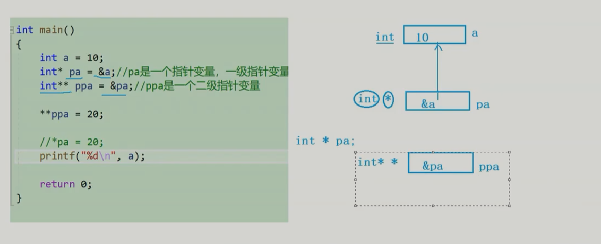

int*  pa   =   &a;

​	最后的\*  表示pa是指针 ， 指针类型是 int

int\**  ppa  =  &pa;

   最后的\*  表示ppa 是指针， 指针类型是 int*


## 作用

二级指针变量 是 存放一级指针变量的 指针变量


## 指针数组


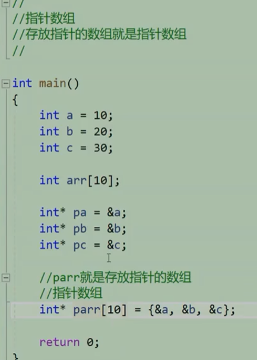


打印指针数组

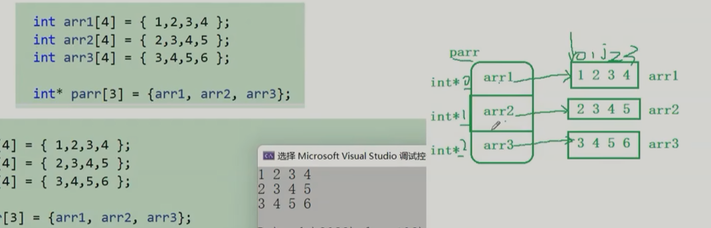

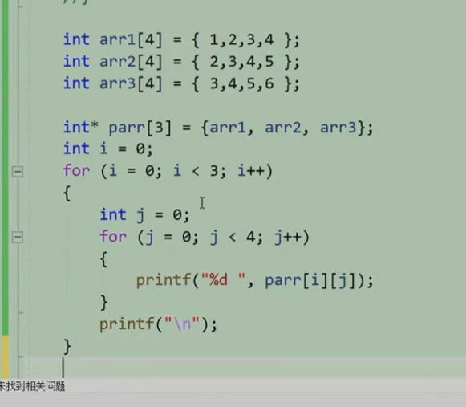


