**https://www.bilibili.com/video/BV1Vm4y1r7jY?t=4676.3&p=124**

# strlen()

返回值  size_t  无符号整型

模拟实现strlen()

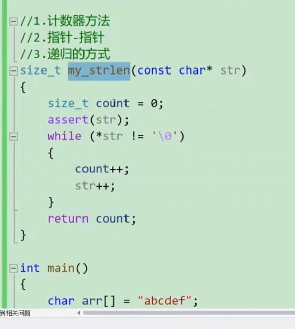

# strcpy()

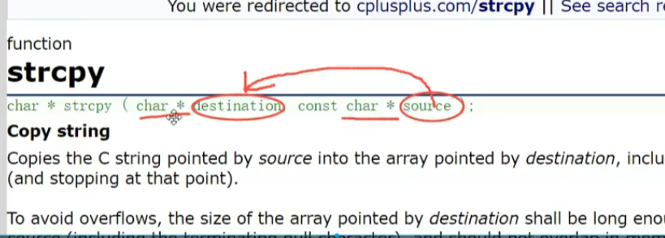

拷贝 包括\0

拷贝\0  停止 

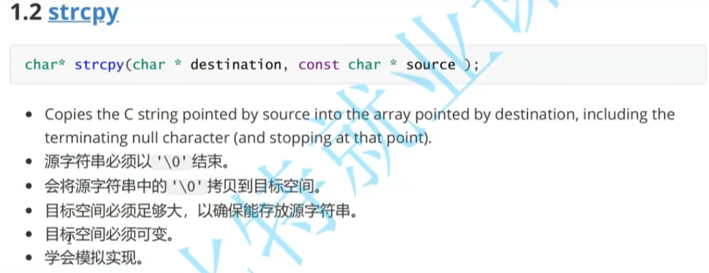

 

`char *p = "abc"`   常量字符串不可写入

返回目标地址 指针

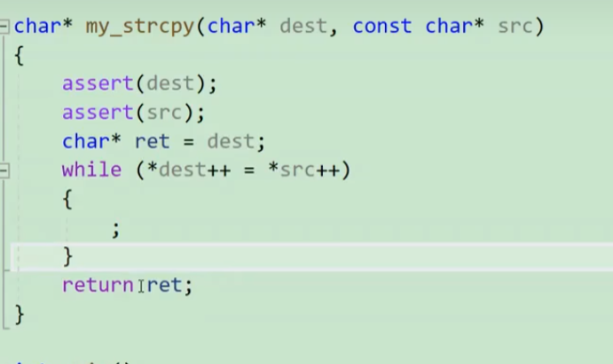

# strcat()

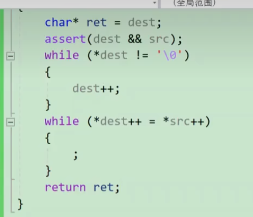

字符串 追加

# strcmp()

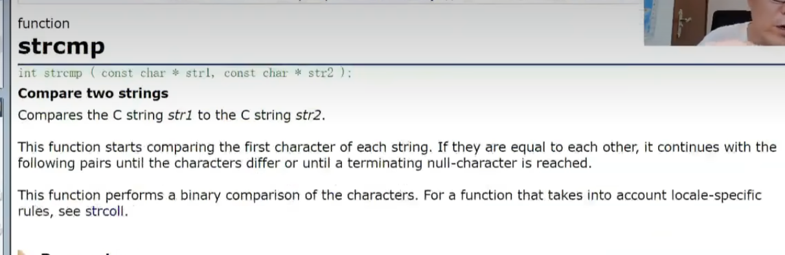

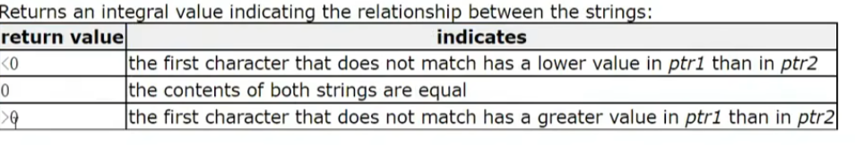

函数返回值int  

字符串函数 string.h

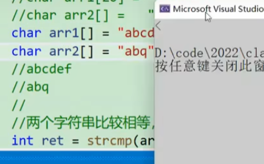

`abcdef < abq`   比较ascall

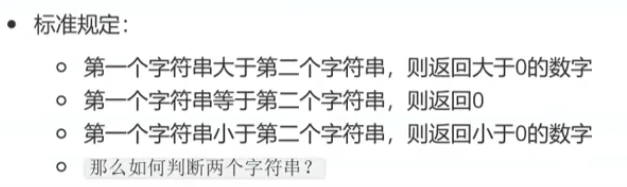

# 总结

strcpy strcat strcmp 

不限制字符长度 

比较危险

长度受限制

strncpy strncat strncmp

(arr1,arr2,num)

# strstr()

查找子串

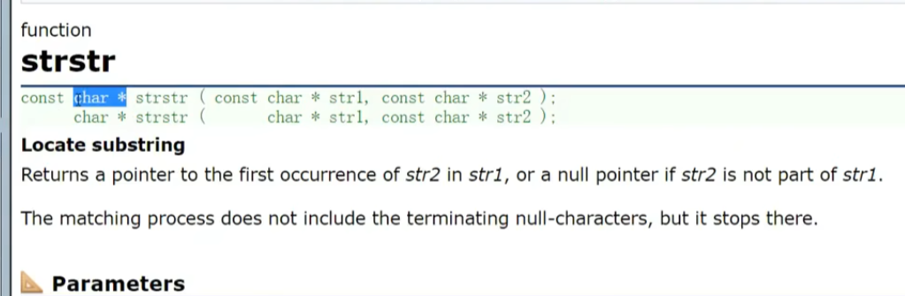

找到返回  子串所在位置指针

找不到，返回空指针

# strtok()

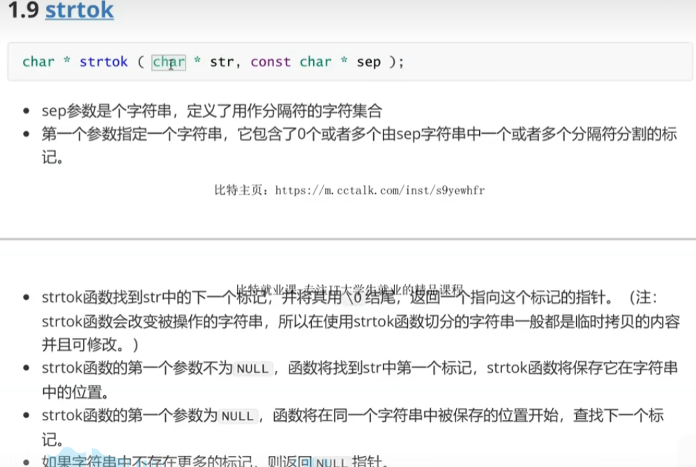

找到标记改变标记

找之后标记的字符串  传入null指针

null指针是一种状态

strtok有记忆功能

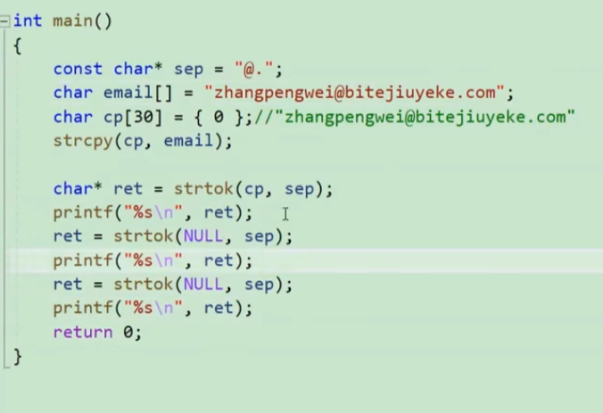

打印所有字符串

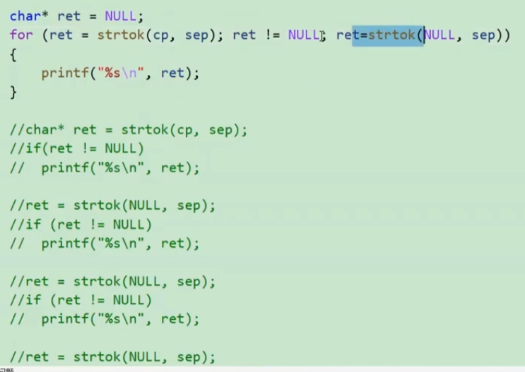

# strerror()

c语言库函数， 执行失败时返回错误码

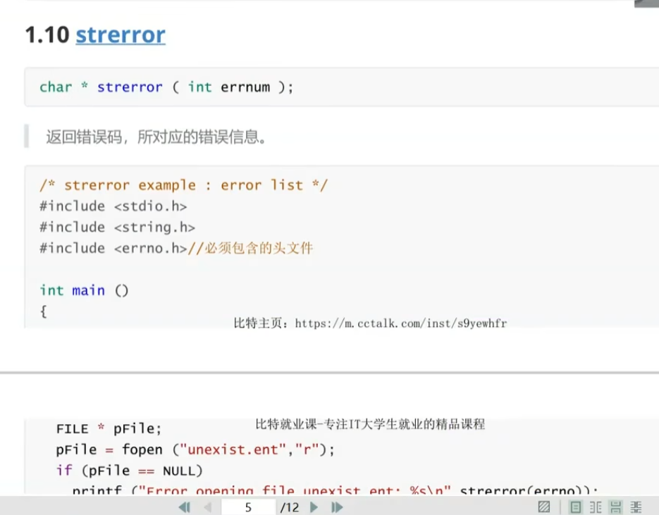

# 字符分类函数

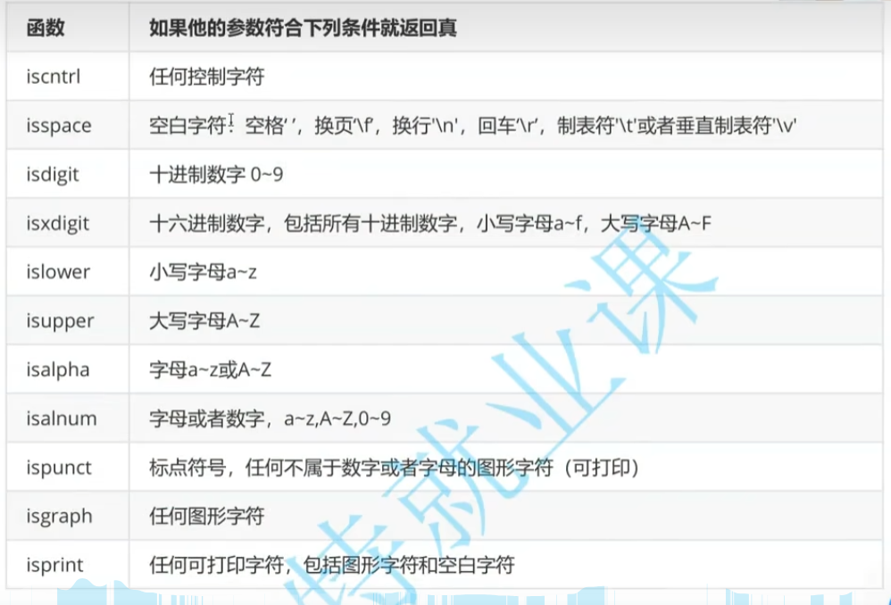

# memecpy()

内存拷贝

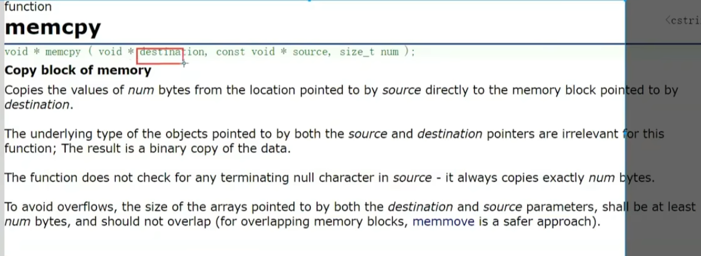

泛型指针  

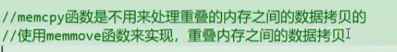

内存不重叠处理

# memmove()

内存重叠

拷贝

https://www.bilibili.com/video/BV1Vm4y1r7jY?t=2845.7&p=125

# memcmp()

作于任意类型数据

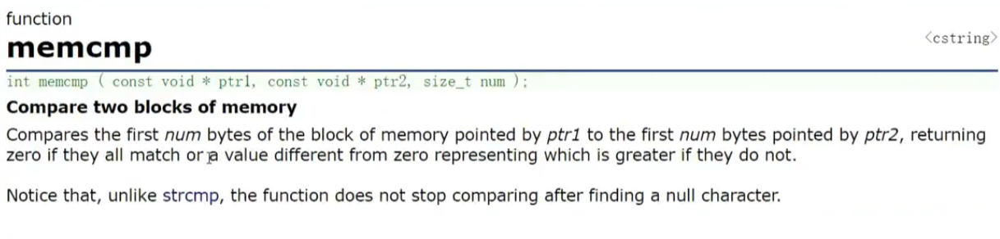

一对字节比较

大于 返回1  

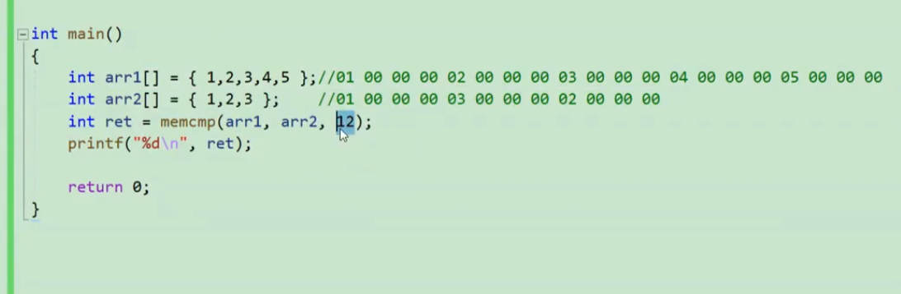

返回-1

12代表比较12个字节后结束比较

# memset()

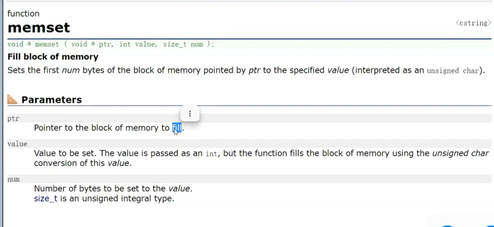

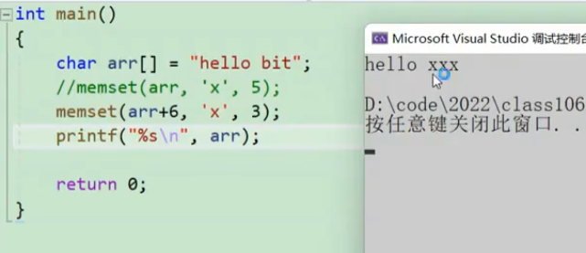

按照字节初始化  

