指针

结构体

动态内存管理


# malloc()

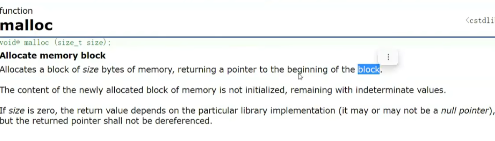


头文件 `stdlib.h`


申请一块内存

开辟失败返回空指针

参数 是 字节数


对函数返回值验证是否空指针后使用


在堆区申请

程序退出后 系统自动回收内存空间


内存泄漏： 丢失可用内存


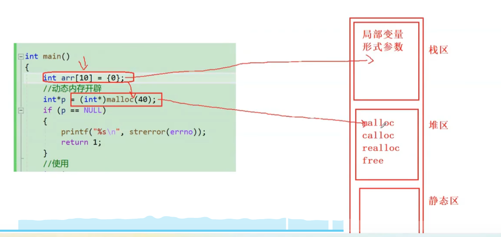


# free()


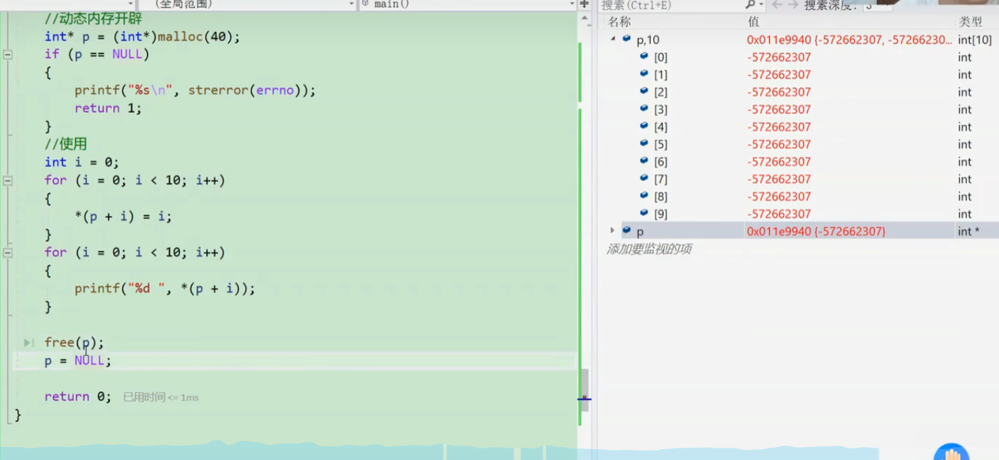

释放指针指向的内存；


释放完后指针 应置空； 比较危险

```c
free(p);
    p = null;
```


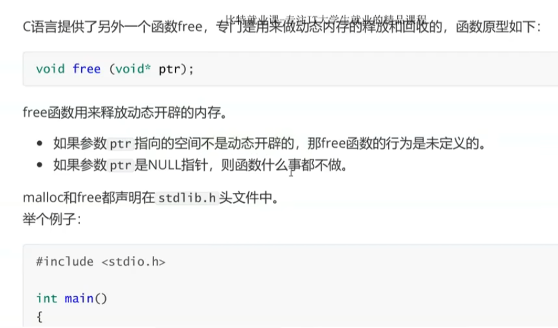


# calloc()

开辟好后内容初始化 赋 0 

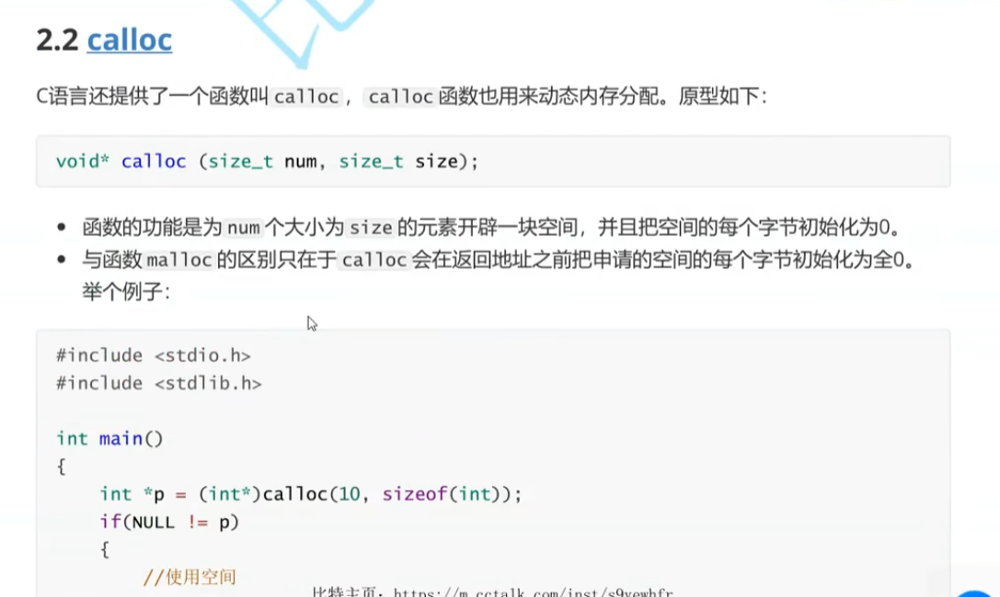

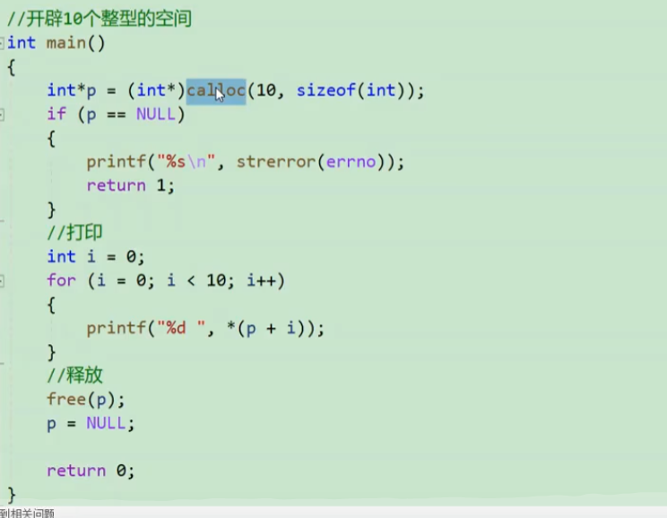


# realloc()

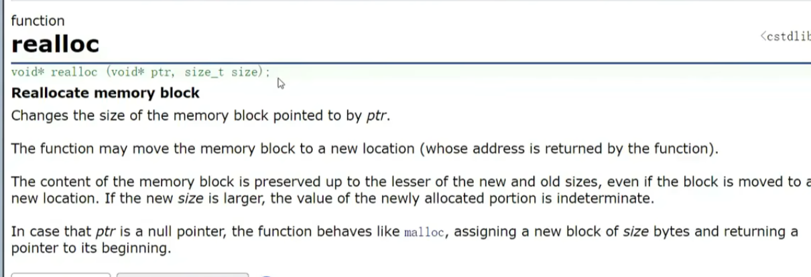

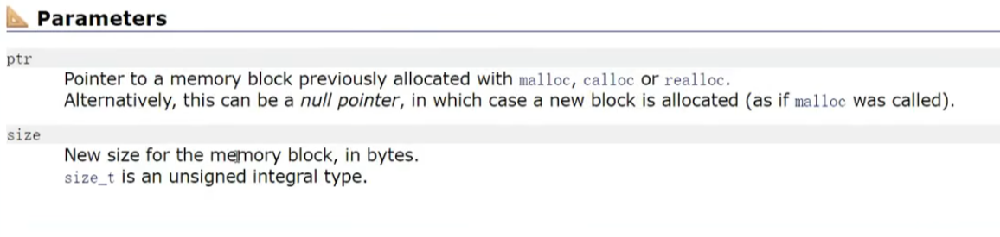


扩容 空间不够时 ，开辟 后 复制 ， 释放旧空间；


可能返回 新的指针  

扩容失败 返回空指针


一般使用新的指针接受返回值  


# 常见错误

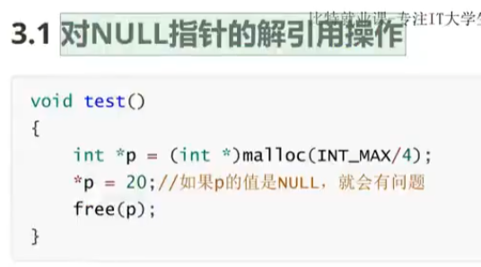


越界

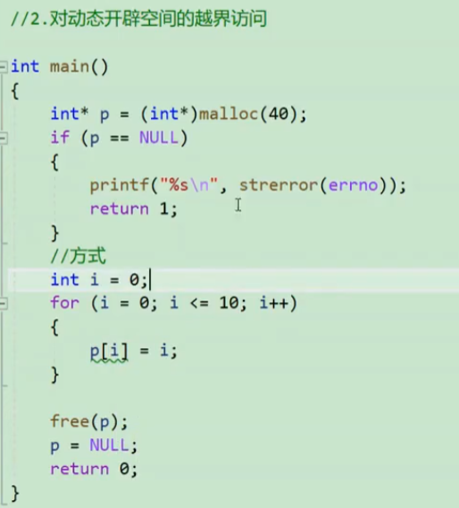


3


4

free 释放动态开辟内存一部分 不可以

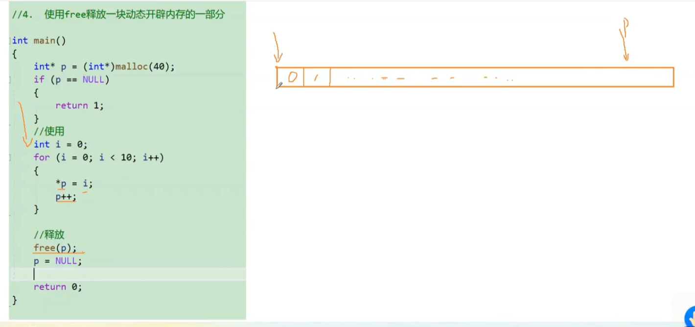


5


6


flag == 5  内存泄漏


# 笔试题

返回栈空间地址的问题

栈空间销毁

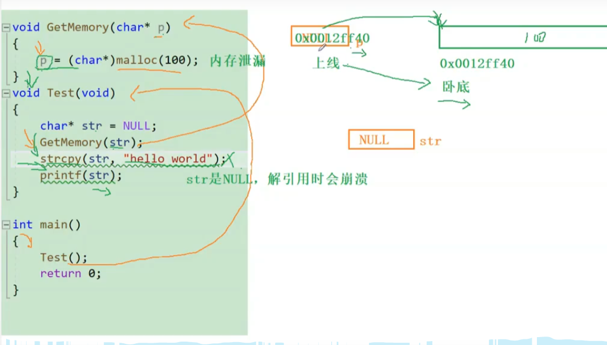


传空指针， 传值  ， str 是空指针

p 指向 一块空间  调用完p销毁， 空间没有释放， 

 

修改后 二级指针

 	


补充

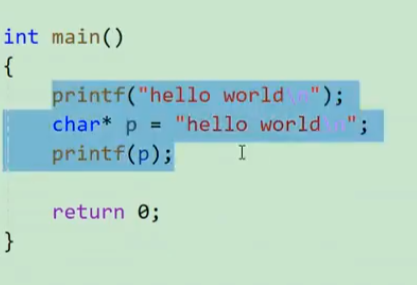

字符串 首地址， 传给printf()；


# 内存区的分布

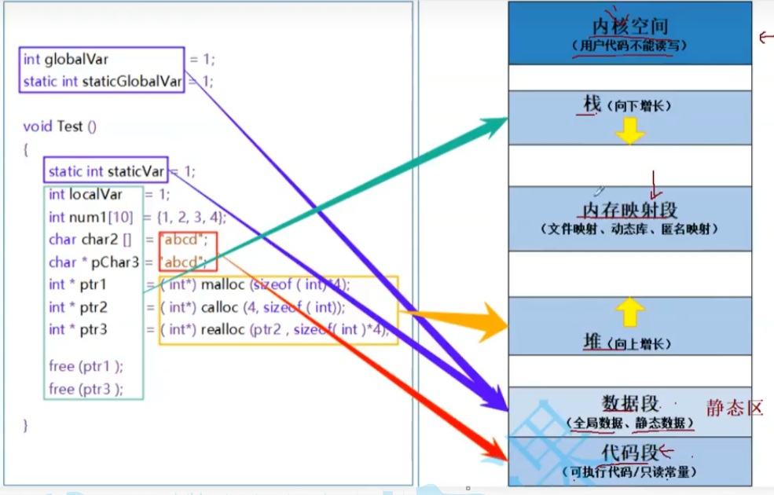


# 柔性数组

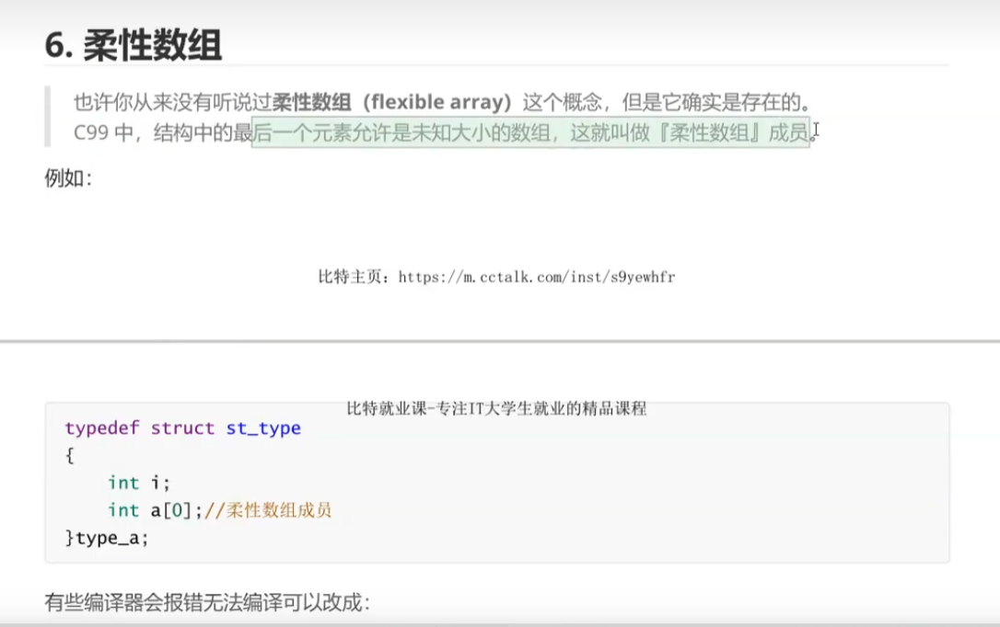

结构体最后一个成员

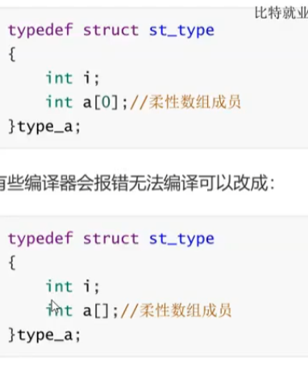


## 定义


sizeof结构体大小 不包含 柔性数组内存


使用 ： malloc（） 给结构体分配内存  大于结构大小

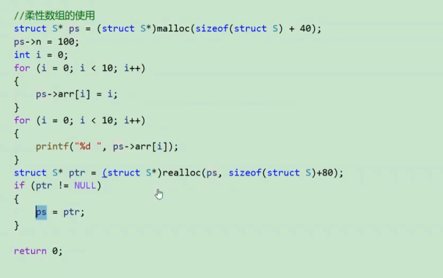

realloc() 扩容 ； 

free 释放空间


方式二  ： malloc 给 结构体空间  

​				malloc 给  数组空间


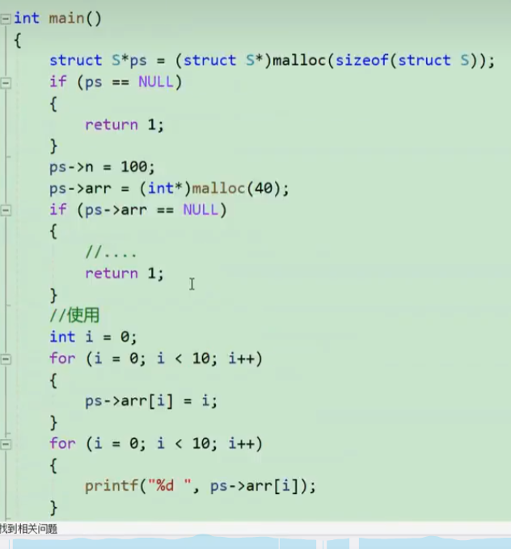

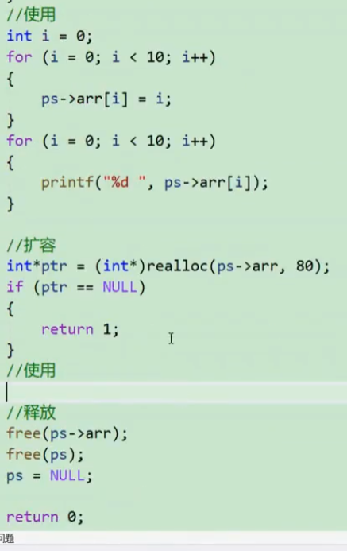


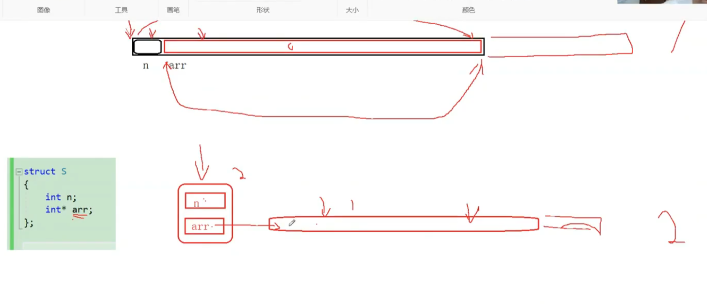


方法1   直接结构体扩容

方法2  arr扩容


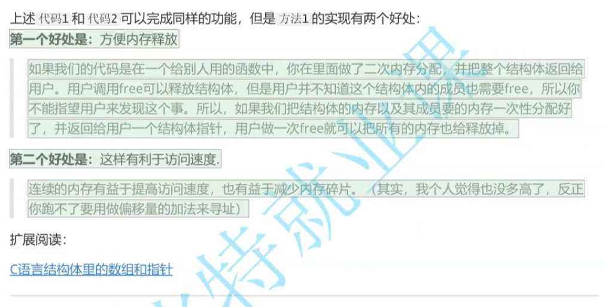