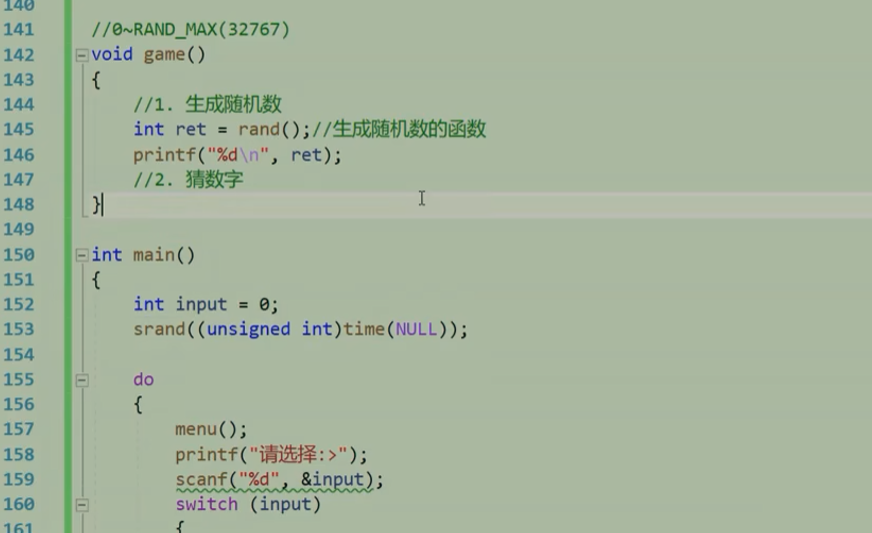
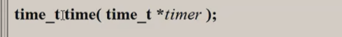
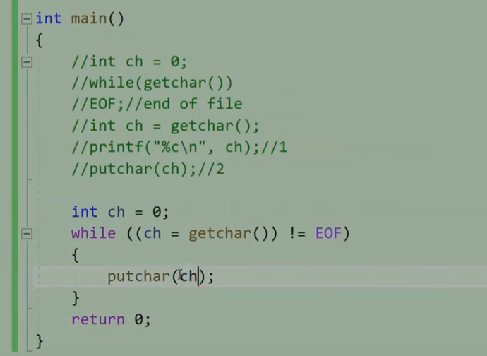
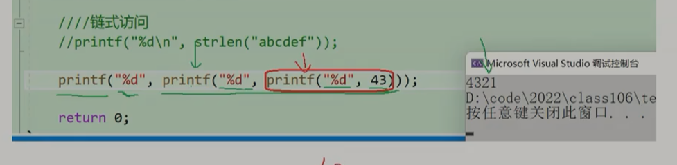
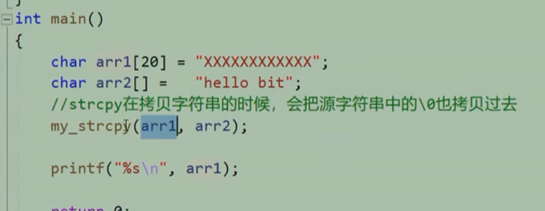
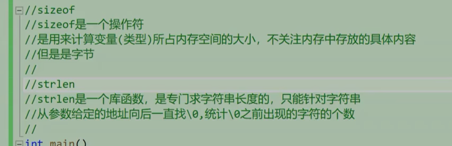

# rand()

返回随机数  0~RAND_MAX 32767

先调用srand

​	

生成1 - 100 随机数

rand()%100 + 1

## srand();

根据变化的值生成随机值 // 主函数调用一次

需要 unsigned int

```c
srand((unsigned int)time(NULL)); // 空指针
```

## time()



返回时间戳  

头文件 <time.h>


# getchar() 

函数读入字符 存为int的阿斯克吗 

​			若读入失败 ， 返回EOF （-1）



# printf()函数

返回字符个数int， 若有错误返回负数



# strcmp() 函数

比较字符串

strcmp(a,b) 真返回1 假返回0


# strcpy()

strcpy(str1,str2);

拷贝2到1的地址里


 拷贝字符串 ：“abc”  会拷贝、0



返回数组目标空间的起始地址 ： char*

# strlen()

```c
#include <stdio.h>
曰//sizeof
//sizeof是一个操作符
/是用来计算变量（类型）所占内存空间的大小，不关注内存中存放的具体内容
/但是是字节
/1
//strlen
/strlen是一个库函数，是专门求字符串长度的，只能针对字符串
/从参数给定的地址向后一直找)，
```



求字符串长度

打印字符数组长度 不包含\0

返回字符串长度	

strlen函数可以通过传首元素的地址来得到字符串的长度

 sizeof 不行


# assert()

assert()  () 中为0 ，NULL 提示报错


头文件  <assert.h>


